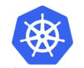
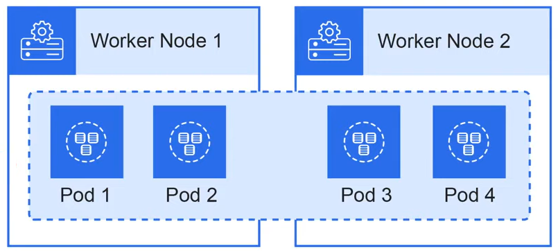

# Kubernetes

## Kubernetes Overview

Kubernetes is an **open-source container orchestration system** for automating the deployment, scaling, and management of containers.

Originally created by Google and is now maintained by the Cloud Native Computing Foundation (CNCF) as a CNCF project.

Kubernetes is commonly called K8s.

A unique component of Kubernetes is **Pods**.

A pod is a group of one more container with shared storage, network resources, and other shared settings.

Kubernetes is ideally for micro-services architecture where a company has tens to hundreds of services they need to manage.

## Kubernetes Components

### Cluster

A logical grouping of all components withing a cluster.

### Namespace

A named logical grouping of Kubernetes components within a cluster. Used to Isolate different workloads on the same cluster.

### Node

A virtual machine or underlying server. There are two types of nodes:
- Control Plane: node manage worker nodes.
- Worket nodes: is where your application or workloads run.

### Pod

The smallest unit in K8s. It is an abstraction over a container. Generally defines an applicatoin workload.

### Service

A static IP address and DNS name for a set of pods (persists an address even if a pod dies) and a load balancer.

### Ingress

Translate HTTP/S rules to point to services.

### API Server

The API server allows users to interact with K8s components using the KubeCTL or by sending HTTP requests.

### Kubelet

Kubelet is an agent installed on all nodes. Kubelet allows users to interact with node via the API server and KubeCTL.

### Cloud Controller Manager

Allows you to link a Cloud Service Provider (CSP) eg. AWS, Azure, GCP to leverage cloud services.

### Controller Manager

A control loop that watches the state of the cluster and will change the currect state backto desdired state.

### Scheduler

Determinies where to place pods on nodes. Places them in a scheduling a queue.

### Kube Proxy

An application on worker nodes that provides routing and filtering rules for ingress (incoming) traffic to pods.

### Network Policy

Acts as a virtual firewall at the namespace level or pod level.

### ConfigMap

ConfigMap allows you to decouple environment specific configuration from your container images, so that your applications are easily portable. Used to store non-confidential data in key-value pair.

### Secret

Small amount of sensitive data such as a password, a token, or a key.

### Volumes

Volumes mounting storage eg. locally on the node, or remote to cloud storage.

### StatefulSet

StatefulSet provides guarantees about the ordering and uniqueness of these Pods.
- Think of databases where you have to determine read and write order or limit the amount of containers.
- StatefulSets are hard when you host your db externally from the K8s cluster.

### ReplicaSets

Maintain a stable set of replica pods running at a given time. Can provide a guarantee of availability.

### Deployment

Is a blueprint for a pod.