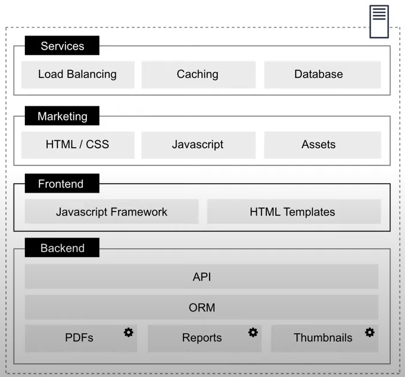
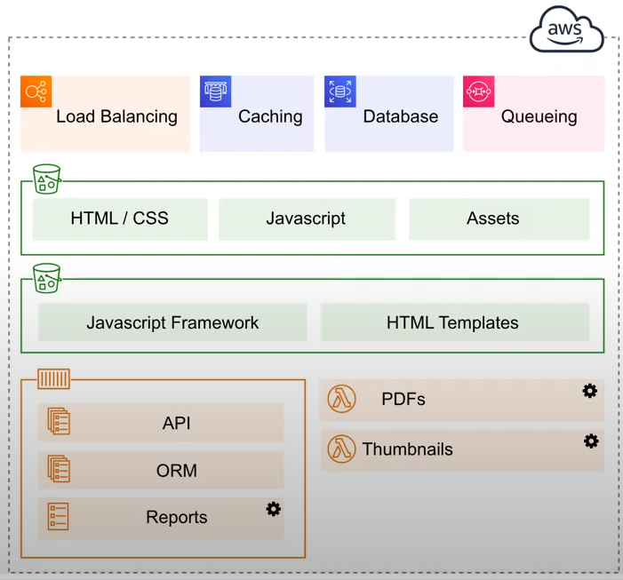

# What are Microservices

## Monolithic Architecture

A monolithic architecture is a traditional model of a software program, which is built as a unified unit that is self-contained and independent from other applications. 

The word **“monolith”** is often attributed to something large and glacial, which isn’t far from the truth of a monolith architecture for software design.

A monolithic architecture is a singular, large computing network with one code base that couples all of the business concerns together.  To make a change to this sort of application requires updating the entire stack by accessing the code base and building and deploying an updated version of the service-side interface. This makes updates restrictive and time-consuming. 

One app which is responsible for everything. Functionality is tightly coupled.

### Advantages of Monolithic Architecture

- Easy deployment
- Development
- Performance
- Simplified Testing
- Easy debugging

### Disadvantages of Monolithic Architecture

- Slower development speed
- Scalability
- Reliability
- Barrier to technology adoption
- Lack of flexibility
- Deployment

## Microservices Architecture

A microservices architecture, also simply known as microservices, is an architectural method that relies on a series of independently deployable services. 

These services have their own business logic and database with a specific goal. Updating, testing, deployment, and scaling occur within each service.

Microservices decouple major business, domain-specific concerns into separate, independent code bases. 

Microservices don’t reduce complexity, but they make any complexity visible and more manageable by separating tasks into smaller processes that function independently of each other and contribute to the overall whole. 

Multiple apps which are each responsible for one thing. Functionality is isolate and stateless.

### Advantages of Microservices Architecture

- Agility
- Flexible scaling
- Continous deployment
- Highly maintainable and testable
- Independently deployable
- High reliablity

### Disadvantages of Microservices Architecture

- Development sprawl
- Exponential infrastructure costs
- Added organizational overhead
- Debugging challenges
- Lack of Standardization
- Lack of clear ownership

