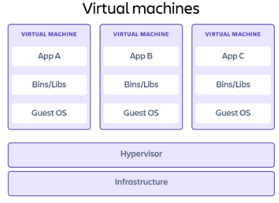
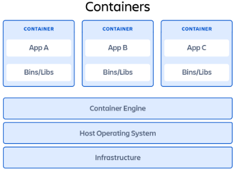
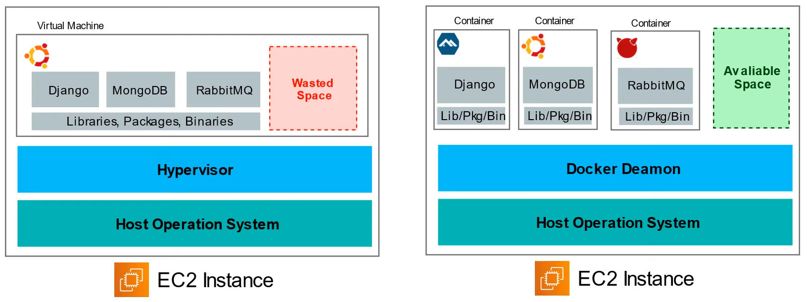

# VMs vs Containers

## What is Virtual Machine

Virtual machines are heavy software packages that provide complete emulation of low level hardware devices like CPU, Disk and Networking devices. Virtual machines may also include a complementary software stack to run on the emulated hardware. These hardware and software packages combined produce a fully functional snapshot of a computational system.

Popular VM providers: Virtual box, VMware etc.

## What is Containers

Containers are lightweight software packages that contain all the dependencies required to execute the contained software application. These dependencies include things like system libraries, external third-party code packages, and other operating system level applications. The dependencies included in a container exist in stack levels that are higher than the operating system.

Popular Container providers: Docker, CRI-O, Linux Containers etc.

## VMs vs Containers

Virtual Machines (VMs) do not make the best use of space. Apps are not isolated which could cause config conflicts, security problems, or resource hogging.

Containers allow you to run multiple apps which are virtually isolated from each other. Launch new containers and configure OS dependencies per container.

