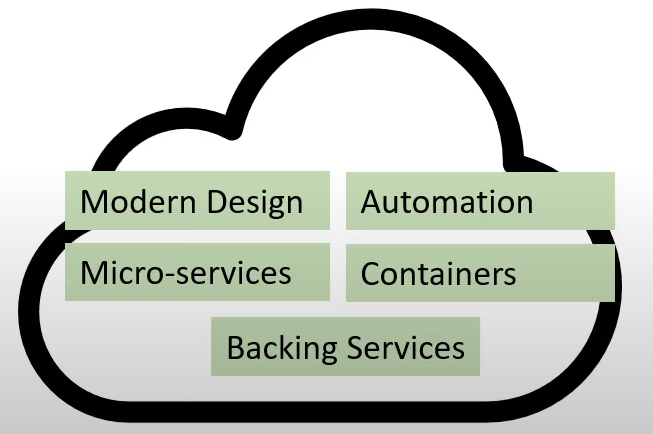
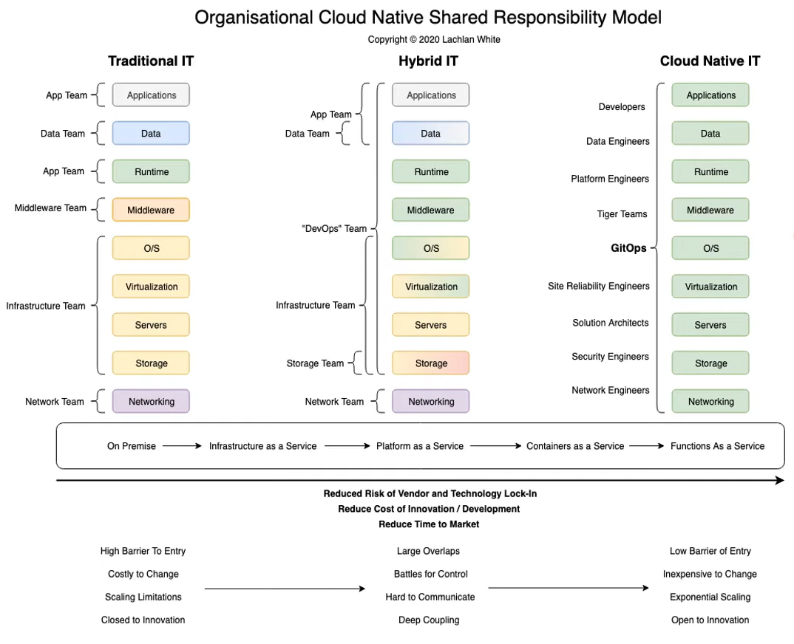

# What is Cloud Native

Cloud Native describes an architectural approach that emphasizes application workloads that are portable, modular and isolate between different cloud deployment models and **cloud service Providers** (CSP).

CSP's commonly describes Cloud Native as a term meaning everything built on the CSP.

This is more so better described as being called "Cloud First".

Some descrive Cloud Native being 4 key principles:

1. Microservices
2. Containerization
3. Continous Delivery
4. DevOps

> [!NOTE]  
> In the context of this exam, Cloud Native will mean technologies like kubernetes and CNCF projects that are both distributed and agnostic to any Cloud Service Provider (CSP).

## Cloud Native definition described by the CNCF

Cloud Native technologies empower organizations to build and run scalable applications in modern, dynamic, environments such as public, private and hybrid clouds. Containers, services, meshes, micriservices, immitable infrastructure, and declarative APIs exemplify this approach.

These techniques enale looselu coupled systems that are resilient, manageable and observable.

Combined with robust automation, they allow engineers, to make high impact changes, frequently and predictably with minimal toll.

The Cloud Native Foundation seeks to drive adoption of this paradigm by fostering and sustaining an ecosystem of open source, vendor neutral projects.

 ## Cloud Native vs Cloud Service Providers

 **A Cloud Service Provider (CSP)**

 - A collection of cloud services
 - Strong application integration and synergies between services
 - Utilizing metered billing
 - Under a single unified API

 Example:
- AWS
- Azure
- Google
- IBM
- many more

 **Cloud Native**

 - a workload, application, or system designed to run on cloud services and takes advantage of cloud offerings.

> [!TIP]  
> Cloud-Native workloads cannot take advantage of all or full the advantage of CSPs because CSPs intentionally have proprietary technology to encourage you to use their managed services with exclusive integrations with other services.

## Cloud Native Shared Responsibility Model

Source: Lachlan White (LachieWhite7)

### Reference

- [Cloud Native](https://www.cncf.io/about/who-we-are/#:~:text=The%20Cloud%20Native%20Computing%20Foundation,of%20the%20nonprofit%20Linux%20Foundation.)